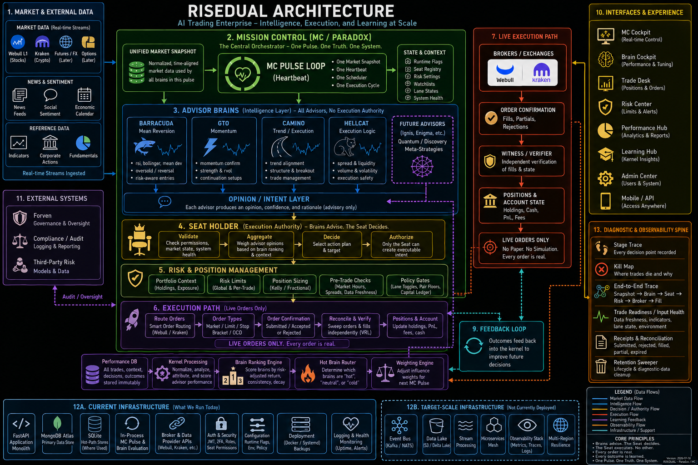

# RISEDUAL Mission Control

**AI Trading Enterprise — Intelligence, Execution, and Learning at Scale.**
Operator console + execution gating + ladder doctrine for the RISE_AI multi-brain
trading system. Live production: [mission.risedual.ai](https://mission.risedual.ai)



## Core Principles

- **Brains advise. The Seat decides.**
- **The Seat executes. No other.**
- **Every order is real.** No paper. No simulation.
- **Every outcome is learned.**
- **One Pulse. One Truth. One System.**

## The Pipeline

```
Pulse → Advisor Brains → Opinion/Intent Layer → Seat Holder → Risk & Sizing
      → Auto-Router → Broker (Webull / Kraken) → Reconcile & Verify (VRL)
      → Learning Kernel → (weights feed the next pulse)
```

Four advisor brains (**Barracuda** mean-reversion, **GTO** momentum, **Camino**
trend/execution, **Hellcat** execution logic) evaluate a unified market snapshot
on every pulse. None has execution authority. A single **Seat Holder** weighs
their opinions and creates executable intent; the **auto-router** — the only
loop allowed to turn intents into broker calls — routes live orders to
**Webull** (equities) and **Kraken** (crypto).

## Diagnostic & Observability Spine

| Tool | Answers |
|---|---|
| **Kill Map** | Where do trades die, stage by stage, and why? |
| **Stage Trace** | Which routing stage was in flight when something hung? |
| **E2E Trace** | Drive one synthetic intent through the whole stack, timed per stage |
| **Trader Post-Mortem** | Why isn't the trader firing? Per-lane fired/hold/risk-blocked |
| **Receipts & Reconciliation** | Independent verification of every broker fill and state |
| **Retention Sweeper** | Autonomous 72h lifecycle for diagnostic data (Atlas IOPS guard) |

## Stack (what runs today — diagram §12A)

| Layer | Technology |
|---|---|
| Frontend | React 19, Tailwind, shadcn/ui — Mission Control cockpit |
| Backend | FastAPI (Python) application monolith |
| Data | MongoDB Atlas (primary), SQLite hot-path stores |
| Brokers | Webull OpenAPI (equities), Kraken Pro (crypto) |
| Auth | JWT, role-based |

*Diagram §12B (Kafka / data lake / microservices) is target-scale, not currently deployed.*

## Key documents in this repo

| File | Audience | Purpose |
|---|---|---|
| **[BRAIN_DEVELOPER_GUIDE.md](BRAIN_DEVELOPER_GUIDE.md)** | Brain pod teams (Alpha, Camaro, Chevelle, REDEYE) | **Single source of truth** for the brain → MC contract. POST shape, doctrine_snapshot, runtime stamp, observation receipts, ladder, prohibitions. |
| [RISE_AI_KERNEL.py](RISE_AI_KERNEL.py) | New engineers, stakeholders | High-level architecture in one file. The 7 boxes of RISE_AI. |
| `memory/PRD.md` | Operator, future agents | Original problem statement, dated changelog, prioritized backlog. |
| `memory/test_credentials.md` | Operator, testing agent | Admin credentials for `mission.risedual.ai`. |
| `backend/tests/README.md` | Engineers | Tripwire suite conventions. 269+ tripwires pin doctrine invariants. |

## Quick links

- Production: https://mission.risedual.ai
- Auth: `/admin@risedual.io` (creds in `memory/test_credentials.md`)
- Diagnostics: `/admin/diagnostics`
- Learning ladder: `GET /api/admin/learning-ladder`
- Observation receipts: `GET /api/admin/observation-receipts/counts`

## If you are a brain pod team integrating with MC

→ **Read `BRAIN_DEVELOPER_GUIDE.md`** first.

Do not read MC internals (`backend/shared/`, `backend/routes/`) before reading the guide.
Most "MC is doing something weird" reports turn out to be contract violations on the brain
side covered explicitly in the guide.

## If you are an engineer touching MC internals

→ Run `pytest -m tripwire -q` before AND after any change.

The tripwire suite is the codified doctrine. Breaking a tripwire means you broke an
intentional invariant. If you genuinely intend to change doctrine (e.g., adding a new gate
to the chain), the tripwire MUST be updated in the same commit and the change documented
in `memory/PRD.md` with a dated section.

## If you are the operator

→ `/admin/diagnostics` is the one-stop dashboard for everything.

Real-time brain liveness, sidecar identity verdict, lane execution toggles, live trade
probe, runtime tokens, doctrine health. Open the sidecar identity panel first when
investigating "why isn't a brain trading".
